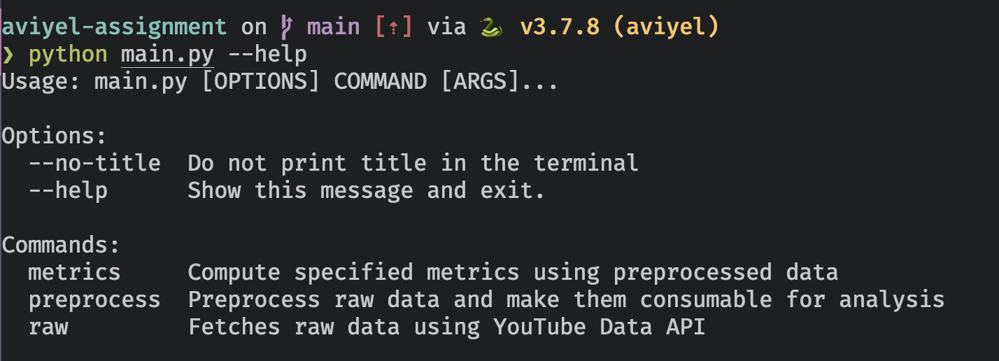
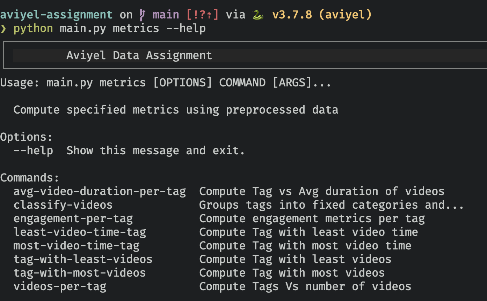
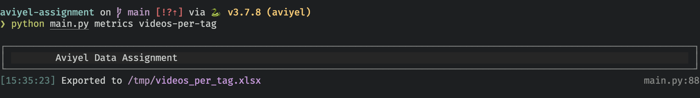
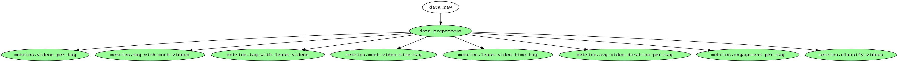
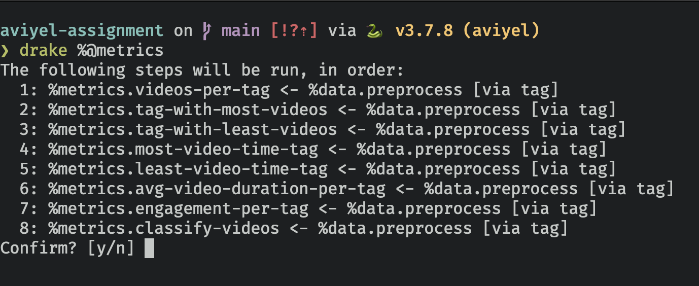

# Aviyel Data Assignment

## Overview

- Fetch details about 500 videos using YouTube Data API
- Compute following metrics
  - Tags vs number videos i.e Number of videos per tag
  - Tag with most videos
  - Tag with least videos
  - Tags vs Avg duration of videos
  - Tag with most video time
  - Tag with least video time
- Classify videos into categories created by grouping tags. Compute above metrics for each category
- Bonus
  - Compute engagement metrics per tag. It includes view, like, dislike, favourite, comment counts
  - ETL pipeline configured using [drake](https://github.com/Factual/drake)
  - Performance analysis of the storage etc [Read More](./docs/performance.md)

## Usage

### Setup Instructions

Project requires `Python 3.7.8`

- Create a virtualenv specifically for this project. This can be created using `pyenv` and [pyenv-virtualenv](https://github.com/pyenv/pyenv-virtualenv) packages. This can be installed using `brew`.

```bash
brew install pyenv
brew install pyenv-virtualenv

# Go to the directory where this code is kept.
# Right way to check whether you are in correct directory or not is to ensure README.md is at the root of it

# Assuming code is kept in `/codes/` directory
cd /codes/aviyel-assignment/

# Create virtualenv
pyenv virtualenv 3.7.8 aviyel
pyenv local aviyel
```

NOTE: All subsequent steps mentioned in the document assumes that virtualenv is activated

- Install requirements

```bash
pip install -r requirements.txt
```

- Set `GOOGLE_API_KEY` in the environment using following command

```bash
export GOOGLE_API_KEY=<YOUR_API_KEY>
```

- Run the following command to check all possible subcommands

```bash
python main.py --help
```

<details markdown="1">
<summary>Screenshot</summary>



</details>

### Execution Instruction

The ETL pipeline involves three stages i.e `raw`, `preprocess` and `metrics`. Each one of them depends on previous stage so they need to be triggered in specific order. This is simplified by configuring an ETL pipeline and details about trigger a pipeline is show in [here](#trigger-etl-pipeline)

NOTE: Recommended way to execute is using [Drake based ETL Pipeline](#trigger-etl-pipeline)

However, each stage can be run independently for debugging purpose. Instructions to run each stage is as follows,

- Run following command to execute `raw` stage. This fetches data using YouTube Data API. It fetches search query result for `python` keyword and then fetches video details for each search result

```bash
python main.py raw
```

- Run following command to execute `preprocess` stage. It parses the data stored in raw stage and perform transformation operations to clean columns and assign categories to videos by grouping them.

```bash
python main.py preprocess
```

- The `metrics` sub-command can be used to compute various metrics. The name of the metrics needs to be passed along with the command to do actual computation.
  The list of available metrics can be found by running following command,

```bash
python main.py metrics --help
```

<details markdown="1">
<summary>Screenshot</summary>



</details>

For example, to compute `Compute Tags Vs number of videos` metric, we need to run following command

```bash
python main.py metrics videos-per-tag
```

Each metric computation saves the data in `xlsx` file and the storage path is printed in the terminal after successful execution

<details markdown="1">
<summary>Screenshot</summary>



</details>

### Trigger ETL Pipeline



Install pre-requisites using following commands

```bash
brew install drake graphviz
```

- Trigger the pipeline

```bash
drake +%@metrics
```

It shows the order in which stages will run and their interdependency. Type `y` in the prompt to execute it

<details markdown="1">
<summary>Screenshot</summary>



</details>

## Design Decisions

_Question - Why the entire project is divided into three stages?_ <br/>
_Answer_ - As mentioned earlier, the ETL pipeline has three stages which are `raw` , `preprocess` and `metrics`. Each stage depends on previous one and needs to be executed in that order. The `raw` stage just fetches the data from the YouTube Data API and stores them in `JSON` format. The `preprocess` stage reads the data stored in `raw` stage and perform various transformation operations to make it easy to consume for metrics computation. The last stage is to compute various `metrics`.
Each stage has its own responsibility and workings. Implementing them separately makes it easy to scale as per requirement. The `raw` stage majorly involves Network I/O as it is fetching data using REST API while the `preprocess` stage is about cleaning and transforming data into appropriate format. The main resources consumed in this stage are disk and CPU/Memory. That's why they are divided into separate stages.

_Question - Why preprocess stage stores data in parquet format?_ <br/>
_Answer_ - `parquet` is a columnar data format i.e if data consumption involves fetching multiple columns (with all rows) rather than multiple rows (with all columns) it will perform better and also saves memory. Also, it stores the data with `snappy` compression which performs better compared to more commonly known format like `gzip`. One more benefit of using `parquet` is it supports partitioning data which makes the data consumption efficient.
